# ComplianceIQ — System Architecture Diagram

**Version:** 1.0 · **Generated:** 2026-09-25
**Scope:** Frontend (React SPA) · Backend (Express) · External integrations (AWS Bedrock, Tavily, regulator portals) · File-backed region data.

This diagram uses [Mermaid](https://mermaid.js.org/). It renders automatically on GitHub and in most Markdown viewers. To view/export as an image, paste the code block below into the [Mermaid Live Editor](https://mermaid.live).

---

## Block Diagram

```mermaid
graph TD
    subgraph EXT["External Integrations (AWS Cloud + Web)"]
        BEDROCK["AWS Bedrock Runtime<br/>Amazon Nova Pro (default)<br/>amazon.nova-pro-v1:0<br/>Claude family auto-supported"]
        TAVILY["Tavily Search API<br/>web grounding / live news"]
        GAZETTES["Official Gazette &amp; Regulator Portals<br/>(link reachability + scraper)"]
    end

    subgraph CLIENT["Frontend — React 19 SPA (Vite + Tailwind v4)"]
        APP["App.tsx<br/>tab routing, feature flags, state"]
        NAV["Navbar.tsx<br/>role/flag-gated nav"]
        subgraph VIEWS["Feature Views"]
            OVERVIEW["CountryOverview"]
            DIGEST["RegionalRegulatoryDigest"]
            RADAR["RegulatoryRadar (scraper = admin only)"]
            HEATMAP["ComplianceMaturityHeatmap"]
            WATCH["RegulatoryWatchlist + ImpactHorizonChart"]
            ROADMAP["RegulatoryRoadmap"]
            TIMELINE["RegulatoryTimeline"]
            DIFFS["VersionDiffViewer"]
            CROSSWALK["ControlsCrosswalk / SectorMatrix / Comparator"]
            AITOOLS["AIComplianceCopilot / AIRedlining / ControlInterpreter"]
        end
        subgraph ADMIN["Admin Console (admin role + password)"]
            ADMINPANEL["AdminPanel"]
            REGEDIT["RegulationEditorTab"]
            DIGESTTAB["DigestFeedTab"]
            TIMEMGR["TimelineManagerTab (benchmark date)"]
            TOGGLES["FeatureTogglesTab"]
            SUGQUEUE["Suggestions Queue"]
            SOURCESTAB["TrackedSourcesManager"]
        end
        subgraph STATE["Client State / Context"]
            ADMINCTX["AdminContext<br/>flags, regs, timeline, digest, benchmark"]
            RBACCTX["RBACContext<br/>roles &amp; permissions"]
            LS["localStorage<br/>watchlist pins, prefs, offline cache"]
        end
    end

    subgraph SERVER["Backend — Express (server.ts) @ :3000 via tsx"]
        REST["REST API (/api/*)"]
        subgraph ENDP["Endpoint Groups"]
            E_CORE["/config /features /countries<br/>/regulations /controls /export"]
            E_FEED["/tracker/updates /digest/updates<br/>/timeline /roadmap /maturity/heatmap"]
            E_SCRAPE["/scraper/* /admin/check-links<br/>/admin/links/*"]
            E_AI["/ai/chat /ai/redline /control/interpret<br/>/ai/smart-insight /ai/maturity-analysis<br/>/ai/analyze-requirements /news/grounded"]
        end
        LOADER["regionLoader.ts<br/>load* / save* (atomic tmp+rename)<br/>graceful in-code fallback"]
        DET["Deterministic engines<br/>controlInterpreterEngine, redlineEngine<br/>(fallback when AI unavailable)"]
    end

    subgraph DATA["File-Backed Data — data/regions/&lt;REGION&gt;/ (default: menat)"]
        D_REG["regulations.json (89)"]
        D_TL["timeline.json (41)"]
        D_RM["roadmap-milestones.json<br/>roadmap-quarters.json"]
        D_MAT["maturity.json"]
        D_SRC["scraper-sources.json (51)"]
        D_NEWS["news-seed.json"]
        D_DIG["digest-updates.json"]
        D_CFG["region.config.json<br/>(label + benchmark date)"]
    end

    ENV[".env<br/>PORT, AWS keys, AWS_REGION,<br/>BEDROCK_MODEL_ID, TAVILY_API_KEY"]

    %% Frontend internal
    APP --> NAV
    APP --> VIEWS
    APP --> ADMIN
    APP --> ADMINCTX
    APP --> RBACCTX
    ADMINCTX --> LS
    NAV --> RBACCTX

    %% Frontend -> Backend (REST over HTTP)
    ADMINCTX -->|"fetch /api/*"| REST
    VIEWS -->|"fetch /api/*"| REST
    ADMIN -->|"admin writes (PUT/POST/DELETE)"| REST

    %% Backend routing
    REST --> ENDP
    E_AI --> DET

    %% Backend -> External
    E_AI -->|"InvokeModelCommand"| BEDROCK
    E_AI -->|"web search"| TAVILY
    E_SCRAPE -->|"HTTP reachability / crawl"| GAZETTES

    %% Backend <-> Data files
    ENDP --> LOADER
    LOADER <-->|"read at startup / write on admin edit"| D_REG
    LOADER <--> D_TL
    LOADER <--> D_RM
    LOADER <--> D_MAT
    LOADER <--> D_SRC
    LOADER <--> D_NEWS
    LOADER <--> D_DIG
    LOADER <--> D_CFG

    %% Config
    ENV -.-> SERVER

    classDef ext fill:#0b3d2e,stroke:#10b981,color:#d1fae5;
    classDef data fill:#1e293b,stroke:#38bdf8,color:#e0f2fe;
    classDef srv fill:#3a2f0b,stroke:#f59e0b,color:#fef3c7;
    class BEDROCK,TAVILY,GAZETTES ext;
    class D_REG,D_TL,D_RM,D_MAT,D_SRC,D_NEWS,D_DIG,D_CFG data;
    class REST,ENDP,E_CORE,E_FEED,E_SCRAPE,E_AI,LOADER,DET srv;
```

---

## Layer Summary

### Frontend — React 19 SPA (Vite + Tailwind v4)
- **`App.tsx`** owns tab routing, feature-flag redirects, and shared state.
- **`Navbar.tsx`** renders navigation gated by feature flags and (for admin-only items) role.
- **Feature views** cover Overview, Digest, Radar, Maturity Heatmap, Watchlist (+ Impact Horizon chart), Roadmap, Timeline, Version Diffs, Crosswalk/Sector/Comparator, and the AI tools.
- **Admin Console** (admin role + password unlock) holds the Regulation editor, Digest Feed editor, Timeline manager (benchmark date), Feature Toggles, Suggestions queue, and Tracked Sources.
- **Context/state:** `AdminContext` (flags, regulations, timeline, digest, benchmark date), `RBACContext` (roles/permissions), and `localStorage` (watchlist pins, preferences, offline cache).

### Backend — Express (`server.ts`, port 3000 via `tsx`)
- Exposes the REST API under `/api/*`, grouped into: core registry, feeds, scraper/link-audit, and AI endpoints.
- **`regionLoader.ts`** reads region JSON at startup and writes back atomically on admin edits, with a graceful in-code fallback if a file is missing.
- **Deterministic engines** provide non-AI fallbacks for the interpreter and redline endpoints.

### External Integrations
- **AWS Bedrock Runtime** — default model **Amazon Nova Pro** (`amazon.nova-pro-v1:0`); Claude models supported via automatic payload detection.
- **Tavily Search API** — web grounding and the live news feed.
- **Official gazette / regulator portals** — targets for link reachability checks and the scraper.

### File-Backed Data — `data/regions/<REGION>/` (default `menat`)
`regulations.json`, `timeline.json`, `roadmap-milestones.json` + `roadmap-quarters.json`, `maturity.json`, `scraper-sources.json`, `news-seed.json`, `digest-updates.json`, `region.config.json`. Swapping this folder (and `REGION`) re-points the app to a new region with no code changes.

### Configuration
`.env` supplies `PORT`, AWS credentials, `AWS_REGION`, `BEDROCK_MODEL_ID`, and `TAVILY_API_KEY`. On EC2/ECS with an IAM role, the AWS key variables can be omitted.
