# ComplianceIQ — System Architecture Diagram

**Version:** 2.0 · **Generated:** 2026-09-26 · **Supersedes:** 1.0 (2026-09-25)
**Scope:** Frontend (React SPA + dual-theme token system) · Backend (Express) · External integrations (AWS Bedrock, Tavily, regulator portals) · File-backed region data · Per-user client state.

This diagram uses [Mermaid](https://mermaid.js.org/). It renders on GitHub and most Markdown viewers. To export as an image, paste the code block below into the [Mermaid Live Editor](https://mermaid.live).

**What's new in v2.0:** dual Dark/Light theme via Tailwind `@theme` tokens (`ThemeContext`); per-user localStorage state (pins, alerts, read/dismissed) keyed by user id; the Admin "Manage Controls" editor; the single `focusRegulation` deterministic deep-link path; and three-state link verification (Verified / Unverified / Not checked).

---

## Block Diagram

```mermaid
graph TD
    subgraph EXT["External Integrations (AWS Cloud + Web)"]
        BEDROCK["AWS Bedrock Runtime<br/>Amazon Nova Pro (default)<br/>amazon.nova-pro-v1:0<br/>Claude family auto-supported"]
        TAVILY["Tavily Search API<br/>web grounding / live news"]
        GAZETTES["Official Gazette &amp; Regulator Portals<br/>(link reachability + scraper)"]
    end

    subgraph CLIENT["Frontend — React 19 SPA (Vite + Tailwind v4 token themes)"]
        APP["App.tsx<br/>tab routing, feature flags,<br/>focusRegulation() deep-link,<br/>per-user watchlist/alert state"]
        NAV["Navbar.tsx<br/>role/flag-gated nav,<br/>Dark/Light toggle, notification bell,<br/>Sync Sources button"]
        subgraph VIEWS["Feature Views"]
            OVERVIEW["CountryOverview"]
            DIGEST["RegionalRegulatoryDigest"]
            RADAR["RegulatoryRadar (scraper = admin only)"]
            HEATMAP["ComplianceMaturityHeatmap"]
            WATCH["RegulatoryWatchlist + ImpactHorizonChart"]
            ROADMAP["RegulatoryRoadmap"]
            TIMELINE["RegulatoryTimeline"]
            DIFFS["VersionDiffViewer"]
            CROSSWALK["ControlsCrosswalk / SectorMatrix / Comparator"]
            AITOOLS["AIComplianceCopilot / AIRedlining / ControlInterpreter"]
            REGCARD["RegulationCard<br/>3-state link status,<br/>key-sample-controls notice"]
        end
        subgraph ADMIN["Admin Console (admin role + password)"]
            ADMINPANEL["AdminPanel"]
            REGEDIT["RegulationEditorTab<br/>+ Manage Controls (NIST/ISO/CSA)"]
            DIGESTTAB["DigestFeedTab"]
            TIMEMGR["TimelineManagerTab (benchmark date)"]
            TOGGLES["FeatureTogglesTab"]
            SUGQUEUE["Suggestions Queue"]
            LINKTAB["LinkIntegrityTab — Verify Links"]
            SOURCESTAB["TrackedSourcesManager"]
        end
        subgraph STATE["Client State / Context"]
            THEMECTX["ThemeContext<br/>dark / light toggle"]
            ADMINCTX["AdminContext<br/>flags, regs (dedupe guard),<br/>timeline, digest, benchmark, link audits"]
            RBACCTX["RBACContext<br/>roles &amp; permissions"]
            LS["localStorage (PER-USER)<br/>pins::uid, custom-notifs::uid,<br/>read::uid, dismissed::uid,<br/>theme, offline cache"]
        end
    end

    subgraph SERVER["Backend — Express (server.ts) @ :3000 via tsx"]
        REST["REST API (/api/*)"]
        subgraph ENDP["Endpoint Groups"]
            E_CORE["/config /features /countries<br/>/regulations /controls /export"]
            E_FEED["/tracker/updates /digest/updates<br/>/timeline /roadmap /maturity/heatmap"]
            E_SCRAPE["/scraper/* (Sync Sources)<br/>/admin/links/* (Verify Links daemon)<br/>/admin/check-links"]
            E_AI["/ai/chat /ai/redline /control/interpret<br/>/ai/smart-insight /ai/maturity-analysis<br/>/ai/analyze-requirements /news/grounded"]
        end
        LOADER["regionLoader.ts<br/>load* / save* (atomic tmp+rename)<br/>graceful in-code fallback"]
        LINKENG["verifyUrlIntegrity()<br/>real HTTP reachability<br/>(12h daemon + on-demand)"]
        DET["Deterministic engines<br/>controlInterpreterEngine, redlineEngine"]
    end

    subgraph DATA["File-Backed Data — data/regions/&lt;REGION&gt;/ (default: menat)"]
        D_REG["regulations.json (89, unique IDs)"]
        D_TL["timeline.json (41)"]
        D_RM["roadmap-milestones.json<br/>roadmap-quarters.json"]
        D_MAT["maturity.json"]
        D_SRC["scraper-sources.json (51)"]
        D_NEWS["news-seed.json"]
        D_DIG["digest-updates.json"]
        D_CFG["region.config.json<br/>(label + benchmark date)"]
    end

    ENV[".env<br/>PORT, AWS keys, AWS_REGION,<br/>BEDROCK_MODEL_ID, TAVILY_API_KEY"]

    %% Frontend internal
    APP --> NAV
    APP --> VIEWS
    APP --> ADMIN
    APP --> THEMECTX
    APP --> ADMINCTX
    APP --> RBACCTX
    THEMECTX --> NAV
    ADMINCTX --> LS
    NAV --> RBACCTX
    VIEWS --> REGCARD
    APP -->|"focusRegulation(exact id)"| REGCARD

    %% Frontend -> Backend (REST over HTTP)
    ADMINCTX -->|"fetch /api/*"| REST
    VIEWS -->|"fetch /api/*"| REST
    ADMIN -->|"admin writes (PUT/POST/DELETE)"| REST

    %% Backend routing
    REST --> ENDP
    E_AI --> DET
    E_SCRAPE --> LINKENG

    %% Backend -> External
    E_AI -->|"InvokeModelCommand"| BEDROCK
    E_AI -->|"web search"| TAVILY
    LINKENG -->|"HTTP reachability"| GAZETTES
    E_SCRAPE -->|"portal crawl"| GAZETTES

    %% Backend <-> Data files
    ENDP --> LOADER
    LOADER <-->|"read at startup / write on admin edit"| D_REG
    LOADER <--> D_TL
    LOADER <--> D_RM
    LOADER <--> D_MAT
    LOADER <--> D_SRC
    LOADER <--> D_NEWS
    LOADER <--> D_DIG
    LOADER <--> D_CFG

    %% Config
    ENV -.-> SERVER

    classDef ext fill:#0b3d2e,stroke:#10b981,color:#d1fae5;
    classDef data fill:#1e293b,stroke:#38bdf8,color:#e0f2fe;
    classDef srv fill:#3a2f0b,stroke:#f59e0b,color:#fef3c7;
    class BEDROCK,TAVILY,GAZETTES ext;
    class D_REG,D_TL,D_RM,D_MAT,D_SRC,D_NEWS,D_DIG,D_CFG data;
    class REST,ENDP,E_CORE,E_FEED,E_SCRAPE,E_AI,LOADER,LINKENG,DET srv;
```

---

## Layer Summary

### Frontend — React 19 SPA (Vite + Tailwind v4 token themes)
- **`App.tsx`** owns tab routing, feature-flag redirects, per-user watchlist/alert state, and the single **`focusRegulation()`** deep-link path that opens the exact regulation by unique id (no code-substring collisions).
- **`Navbar.tsx`** renders flag/role-gated nav, the **Dark/Light theme toggle**, the notification bell (per-user alerts with dismiss/X, admin operational reminders), and the **Sync Sources** button.
- **`ThemeContext`** manages dark/light selection; theming is delivered by Tailwind v4 `@theme` token remaps in `src/index.css` (light rules scoped under `html.light`).
- **Feature views** include the `RegulationCard` (three-state link status + key-sample-controls notice) and the AI tools.
- **Admin Console** adds **Manage Controls** in the Regulation editor (per-control NIST/ISO/CSA mappings, persisted) and **Verify Links** in the Link Integrity tab.
- **Client state:** `ThemeContext`, `AdminContext` (flags, regs with load-time dedupe guard, timeline, digest, benchmark, link-audit results), `RBACContext`, and **per-user localStorage** keys (`pins`, `custom-notifications`, `read`, `dismissed`, each suffixed `::<userId>`) plus theme + offline cache.

### Backend — Express (`server.ts`, port 3000 via `tsx`)
- REST API under `/api/*`: core registry, feeds, scraper/link-audit, and AI endpoints.
- **`verifyUrlIntegrity()`** performs real HTTP reachability checks (redirect-following, timeouts, WAF/403 handling), driven by the 12-hour daemon and the on-demand **Verify Links** action; results feed the three-state card badges.
- **`regionLoader.ts`** reads region JSON at startup and writes back atomically on admin edits (Manage Controls edits persist here).
- **Deterministic engines** provide non-AI fallbacks.

### External Integrations
- **AWS Bedrock Runtime** — default **Amazon Nova Pro** (`amazon.nova-pro-v1:0`); Claude supported via automatic payload detection.
- **Tavily Search API** — web grounding and live news.
- **Official gazette / regulator portals** — targets for link reachability (Verify Links) and the source crawl (Sync Sources).

### File-Backed Data — `data/regions/<REGION>/` (default `menat`)
`regulations.json` (89, all unique IDs), `timeline.json` (41), `roadmap-*.json`, `maturity.json`, `scraper-sources.json` (51), `news-seed.json`, `digest-updates.json`, `region.config.json`. Swapping this folder (and `REGION`) re-points the app to a new region with no code changes.

### Configuration
`.env` supplies `PORT`, AWS credentials, `AWS_REGION`, `BEDROCK_MODEL_ID`, `TAVILY_API_KEY`. On EC2/ECS with an IAM role, the AWS key variables can be omitted.
