# ComplianceIQ — System Architecture Diagram

**Version:** 3.0 · **Generated:** 2026-10-07 · **Supersedes:** 2.0 (2026-09-26)
**Scope:** Frontend (React SPA + dual-theme tokens) · Backend (Express) · Server-authoritative multi-admin data · bcrypt authentication · Document storage (S3 / Cloudflare R2) · Encrypted audit log · External integrations (AWS Bedrock, Tavily) · Three deployment editions.

This diagram uses [Mermaid](https://mermaid.js.org/). It renders on GitHub and most Markdown viewers. To export as an image, paste a code block below into the [Mermaid Live Editor](https://mermaid.live).

---

## What's new in v3.0

Relative to v2.0, this release makes the platform **multi-admin safe** and adds **document management** and **hardened authentication**:

1. **Regulation document management.** Admins upload documents (regulation texts, internal RCMs / controls libraries) per regulation; all onboarded users download them. Files are stored in **private object storage** — **Amazon S3** on the AWS editions, **Cloudflare R2** on the Gemini edition — encrypted at rest, proxied through the app (no public bucket). Max 5 MB/file, up to 10 files per regulation.
2. **Server-authoritative multi-admin state.** All admin-mutable data now lives server-side (region JSON files) and syncs across every admin and device: users, link suggestions, field-correction suggestions, broadcast banner, feature flags, and countries/jurisdictions. No feature depends on browser localStorage anymore (localStorage is only an offline display cache). Admin panel refetches on open + a Refresh button.
3. **bcrypt authentication.** Login is verified **server-side** against bcrypt password hashes (`/api/auth/login`); hashes never reach the browser. Admin create-user, admin reset-password, and user self-service change-password are all server endpoints. The user roster (`users.json`) stores only hashes — never plaintext. One-click account switching and credential hints removed; switching accounts requires logout → login. A self-service password change forces re-login with the new password.
4. **Encrypted audit log.** Audit events are written to object storage (S3/R2, encrypted at rest) as a JSON Lines file; the admin panel reads the shared log on screen and downloads a readable CSV. All admins see all admins' actions.
5. **Feature-toggle semantics.** Toggles gate **normal users only** — admins always have access to every feature (`effectiveFeatureFlags`); the admin console still shows/edits the true toggle state.
6. **ALB Cognito session timeout = 24h.** The public ALB forces Cognito re-authentication (with MFA) at least daily.

---

## Block Diagram

```mermaid
graph TD
    subgraph EXT["External Integrations"]
        BEDROCK["AWS Bedrock Runtime<br/>Amazon Nova Pro (default)<br/>Claude family auto-supported"]
        TAVILY["Tavily Search API<br/>web grounding / live news"]
        GAZETTES["Official Gazette &amp; Regulator Portals<br/>(link reachability + scraper)"]
    end

    subgraph CLIENT["Frontend — React 19 SPA (Vite + Tailwind v4 token themes)"]
        APP["App.tsx<br/>tab routing, effectiveFeatureFlags gating,<br/>focusRegulation() deep-link"]
        NAV["Navbar.tsx<br/>role/flag-gated nav, Dark/Light,<br/>account menu (login/logout/change-pw)"]
        subgraph VIEWS["Feature Views"]
            REGCARD["RegulationCard<br/>+ RegulationDocuments<br/>(download all · upload admin)"]
            AITOOLS["AI Copilot / Redlining / Interpreter"]
            OTHER["Overview · Digest · Radar · Heatmap<br/>Watchlist · Roadmap · Timeline · Crosswalk"]
        end
        subgraph ADMIN["Admin Console (admin login + 2nd password gate)"]
            REGEDIT["RegulationEditorTab (+ docs, Manage Controls)"]
            USERS["UserManagementTab<br/>create / reset / delete (bcrypt, no plaintext)"]
            AUDITTAB["AuditTrailTab<br/>shared log view + CSV download"]
            SUGQUEUE["Suggestions Queue (server-synced)"]
            TOGGLES["FeatureTogglesTab (true state)"]
            COUNTRYTAB["CountryManagementTab (server-synced)"]
            BROADCASTTAB["BroadcastBannerTab (server-synced)"]
        end
        subgraph STATE["Client State / Context"]
            ADMINCTX["AdminContext<br/>server-authoritative fetch + refreshAdminData()<br/>effectiveFeatureFlags (admin bypass)"]
            RBACCTX["RBACContext — roles & permissions"]
            LSCACHE["localStorage — OFFLINE CACHE + session only<br/>(auth state, current user; never source of truth)"]
        end
    end

    subgraph GATE["Edge / Access (AWS editions)"]
        ALB["Application Load Balancer (public, HTTPS 443)<br/>authenticate-cognito action<br/>SessionTimeout = 86400s (24h)"]
        COGNITO["Amazon Cognito User Pool<br/>login + MFA (TOTP)"]
    end

    subgraph SERVER["Backend — Express (server.ts)"]
        REST["REST API (/api/*)"]
        subgraph ENDP["Endpoint Groups"]
            E_AUTH["/auth/login /auth/change-password<br/>/users (CRUD + reset-password)"]
            E_DOCS["/regulations/:id/documents (list/upload)<br/>/documents/:id/download · DELETE"]
            E_SYNC["/link-suggestions /regulation-suggestions<br/>/broadcast /feature-flags /countries"]
            E_AUDIT["/audit-logs (GET/POST)<br/>/audit-logs/download (CSV)"]
            E_CORE["/regulations /controls /timeline<br/>/digest /maturity /export /config"]
            E_AI["/ai/* /control/interpret /news/grounded"]
        end
        USERSTORE["userStore.ts<br/>bcrypt hash/verify, seed, MACDs"]
        AUDITSTORE["auditStore.ts<br/>append + CSV, object store (SSE)"]
        DOCSTORE["documentStore.ts<br/>S3 (AWS) / R2 (Gemini) / local fallback"]
        LOADER["regionLoader.ts<br/>load*/save* (atomic tmp+rename)"]
    end

    subgraph OBJ["Private Object Storage (encrypted at rest, SSE)"]
        S3DOCS["S3 bucket — documents + audit-logs/<br/>(AWS editions)"]
        R2DOCS["Cloudflare R2 — documents + audit-logs/<br/>(Gemini edition)"]
    end

    subgraph DATA["File-Backed Region Data — data/regions/&lt;REGION&gt;/ (EFS on AWS / disk on Gemini)"]
        D_REG["regulations.json"]
        D_USERS["users.json (bcrypt hashes)"]
        D_SUG["link-suggestions.json · regulation-suggestions.json"]
        D_CTRY["countries.json"]
        D_FLAGS["feature-flags.json"]
        D_BCAST["broadcast.json"]
        D_MISC["timeline · roadmap · maturity · digest · config"]
    end

    %% Access path (AWS editions)
    ALB -->|"force login + MFA"| COGNITO
    ALB -->|"authenticated → app"| CLIENT

    %% Frontend internal
    APP --> NAV
    APP --> VIEWS
    APP --> ADMIN
    APP --> ADMINCTX
    APP --> RBACCTX
    ADMINCTX --> LSCACHE
    VIEWS --> REGCARD

    %% Frontend -> Backend
    ADMINCTX -->|"fetch /api/* (read on load + Refresh)"| REST
    ADMIN -->|"admin writes PUT/POST/DELETE"| REST
    REGCARD -->|"upload / download / list docs"| REST

    %% Backend routing
    REST --> ENDP
    E_AUTH --> USERSTORE
    E_AUDIT --> AUDITSTORE
    E_DOCS --> DOCSTORE
    E_SYNC --> LOADER
    E_CORE --> LOADER

    %% Stores -> object storage
    DOCSTORE -->|"PutObject/GetObject (private)"| S3DOCS
    DOCSTORE -->|"S3-compatible API"| R2DOCS
    AUDITSTORE -->|"append JSONL (SSE)"| S3DOCS
    AUDITSTORE -->|"append JSONL (SSE)"| R2DOCS

    %% Backend <-> region files
    USERSTORE --> D_USERS
    LOADER <--> D_REG
    LOADER <--> D_SUG
    LOADER <--> D_CTRY
    LOADER <--> D_FLAGS
    LOADER <--> D_BCAST
    LOADER <--> D_MISC

    %% Backend -> external
    E_AI -->|"InvokeModel"| BEDROCK
    E_AI -->|"web search"| TAVILY
    E_CORE -->|"reachability / crawl"| GAZETTES

    classDef ext fill:#0b3d2e,stroke:#10b981,color:#d1fae5;
    classDef data fill:#1e293b,stroke:#38bdf8,color:#e0f2fe;
    classDef srv fill:#3a2f0b,stroke:#f59e0b,color:#fef3c7;
    classDef gate fill:#3b0b3d,stroke:#d946ef,color:#fae8ff;
    classDef obj fill:#0b2e3d,stroke:#06b6d4,color:#cffafe;
    class BEDROCK,TAVILY,GAZETTES ext;
    class D_REG,D_USERS,D_SUG,D_CTRY,D_FLAGS,D_BCAST,D_MISC data;
    class REST,ENDP,E_AUTH,E_DOCS,E_SYNC,E_AUDIT,E_CORE,E_AI,USERSTORE,AUDITSTORE,DOCSTORE,LOADER srv;
    class ALB,COGNITO gate;
    class S3DOCS,R2DOCS obj;
```

---

## Deployment editions

ComplianceIQ ships in three editions that share the same `src/` application code but differ in backend AI provider, object storage, and infrastructure.

| Aspect | AWS "normal" (ComplianceIQAMZ) | AWS External | Gemini |
|--------|-------------------------------|--------------|--------|
| AI engine | AWS Bedrock (Nova/Claude) | AWS Bedrock (Nova/Claude) | Google Gemini |
| Web search | Tavily | Tavily | Google / Tavily |
| Document + audit storage | Amazon S3 (private, SSE) | Amazon S3 (private, SSE) | Cloudflare R2 (private, SSE) |
| Region/app data | EFS volume | EFS volume | Deployment disk/volume |
| Edge auth | Public ALB + Cognito + MFA (24h) | Public ALB + Cognito + MFA (24h) | Host-dependent |
| Infra | CDK (ECS Fargate) | CDK (ECS Fargate) | Host-dependent |

The in-app login (bcrypt, server-side), feature-toggle semantics, multi-admin data sync, and document/audit features are **identical across all three editions**.

---

## Layer summary

### Frontend — React 19 SPA
- `App.tsx` and `Navbar.tsx` gate feature visibility by **`effectiveFeatureFlags`** (admins see all; normal users gated by the real toggles).
- `RegulationCard` embeds `RegulationDocuments`: download chips for all users; upload/manage controls for admins only.
- Account menu (`UserAccountSwitcher`): current identity, **Change Password** (self-service, forces re-login), and **Sign Out**. No account list, no switching, no credential hints.
- `AdminContext` is **server-authoritative**: it fetches users, suggestions, broadcast, flags, and countries from the server on load and via `refreshAdminData()` (admin-panel open + Refresh button). localStorage is only an offline cache and per-browser session state.

### Backend — Express (`server.ts`)
- **`userStore.ts`** — bcrypt (cost 12) hash/verify; seeds the roster on first run; create/update/delete/reset/change endpoints. Hashes never leave the server.
- **`auditStore.ts`** — appends audit events to a JSONL file in object storage (encrypted at rest); serves a readable CSV download.
- **`documentStore.ts`** — stores document bytes in S3 (AWS) or R2 (Gemini), with a local-disk fallback for development.
- **`regionLoader.ts`** — atomic read/write of all region JSON (regulations, suggestions, countries, flags, broadcast, timeline, etc.).

### Edge / Access (AWS editions)
- Public **Application Load Balancer** (HTTPS 443) with an `authenticate-cognito` default action → **Amazon Cognito** user pool (login + TOTP MFA). **`SessionTimeout = 86400s (24h)`** forces at-least-daily re-authentication. Private subnets stay shielded; a VPC Block Public Access exclusion covers only the ALB's public subnets.

### Object storage (encrypted at rest)
- Private bucket per edition (S3 / R2), Block Public Access on, TLS enforced, versioned. Holds uploaded documents under `<region>/regulations/<id>/…` and the audit log under `<region>/audit-logs/audit-log.jsonl`. Access is proxied by the app via its IAM role / API credentials — the bucket is never public.

### Region data
`data/regions/<REGION>/`: `regulations.json`, `users.json` (bcrypt hashes), `link-suggestions.json`, `regulation-suggestions.json`, `countries.json`, `feature-flags.json`, `broadcast.json`, plus timeline/roadmap/maturity/digest/config. On AWS this lives on the EFS volume (survives restarts, backed up); on Gemini it lives on the deployment disk/volume. Runtime files are git-ignored and seeded on first run.

### Configuration (environment)
`.env` / task environment supplies `PORT`, `AWS_REGION`, `BEDROCK_MODEL_ID`, `TAVILY_API_KEY`, `DOCUMENTS_BUCKET` (AWS S3), and for the Gemini edition the Cloudflare R2 variables (`R2_ENDPOINT`, `R2_BUCKET`, `R2_ACCESS_KEY_ID`, `R2_SECRET_ACCESS_KEY`). On ECS the AWS key variables are omitted (the task IAM role is used).
